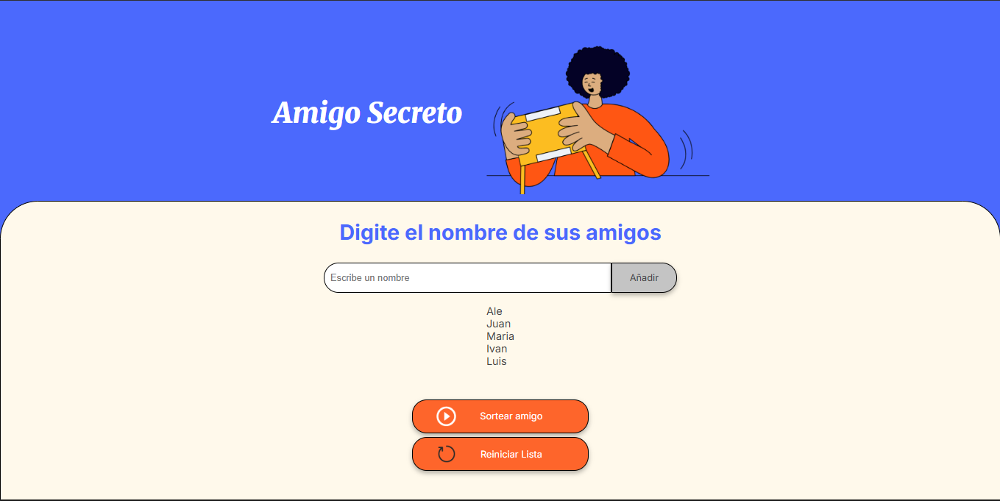
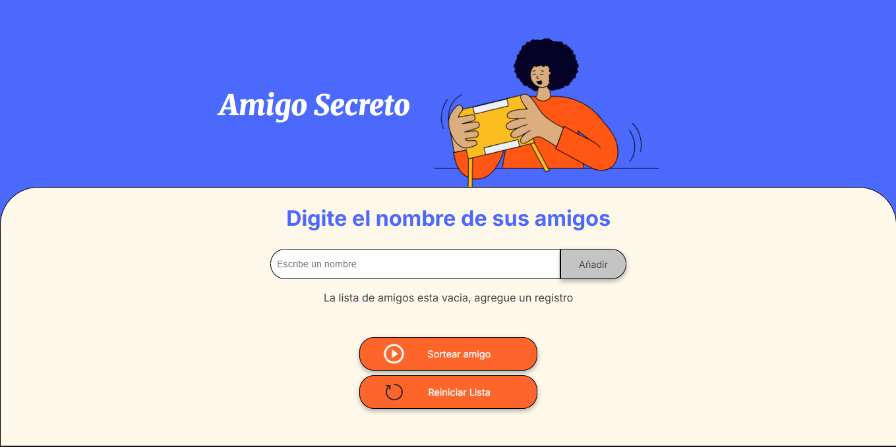

# ALURA_Challenge_Amigo_Secreto
Proyecto desarrollado para el programa "Oracle Next Education" donde se ingresa y se selecciona un nombre aleatorio para el amigo secreto. El proyecto es desarrollado con HTML, CSS y JavaScript.

## Funcionalidades
- Agregar nombres de amigos a una lista y mostrarla en pantalla.

- Sortear un nombre de la lista de amigos creada.

- Reiniciar el juego con una nueva lista vacia.

